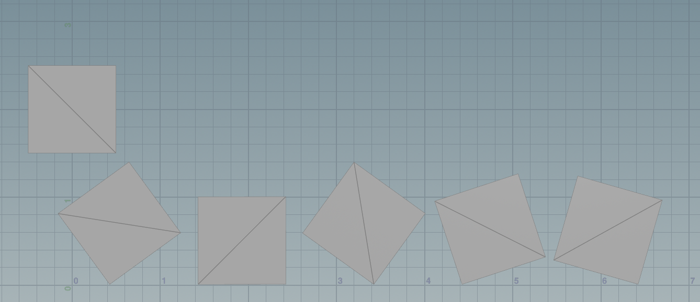

# Animation

Prequsites: [Geometry](./geometry.md), [Concepts](./concepts.md)

---

Simulation without interaction is boring! So comes the animation!

`Animation` in `libuipc` gives such a way to specify the translation, rotation, deformation and even anything of a geometry over time. 

An `Animation` can be a pre-designed offline animation, or a real-time input from user interaction.

In this tutorial, we will go through the basic usage of `Animation` in `libuipc`.

## Walking Cube

In this section, we will animate a cube rotating around its own x-axis, and so it can walk on the ground with the help of friction force.

Here we assume you have already defined the `engine`, `world`, `scene` and loaded the cube geometry with the name `cube_mesh`. Of course, don't forget `label_surface` and `label_triangle_orient` for the cube mesh, which is necessary to tell `libuipc` where the surface is and to export correct oriented surface mesh.

Though friction is default enabled in `libuipc`, it's good to know how to turn on/off the friction explicitly.

=== "C++"

    ```cpp
    auto config = Scene::default_config();
    config['contact']['friction']['enable'] = true;
    ...
    auto scene = Scene(config);
    ```

=== "Python"

    ```python
    config = Scene.default_config()
    config['contact']['friction']['enable'] = True
    scene = Scene(config)
    ```

Then we need to define the constitution and constraint for the cube.


=== "C++"

    ```cpp
    ...

    AffineBodyConstitution abd;
    RotatingMotor          rm;

    // create object
    auto cube_object = scene.objects().create("cube");
    {
        // apply the constitution and constraint
        abd.apply_to(cube_mesh, 10.0_MPa);
        rm.apply_to(
            cube_mesh, 
            100.0, // constraint strength ratio
            Vector3::UnitX(), // rotation axis
            std::numbers::pi / 1.0_s // rotation speed
        );

        // move the cube up by 2 units
        auto trans_view = view(cube_mesh.transforms());
        {
            Transform t = Transform::Identity();
            t.translate(Vector3::UnitY() * 2);
            trans_view[0] = t.matrix();
        }

        cube_object->geometries().create(cube_mesh);
    }

    auto ground_obj = scene.objects().create("ground");
    {
        auto g = ground();
        ground_obj->geometries().create(g);
    }
    ```

=== "Python"

    ```python
    ...

    abd = AffineBodyConstitution()
    rm = RotatingMotor()

    # create object
    cube_object = scene.objects().create("cube")
    
    # apply the constitution and constraint
    abd.apply_to(cube_mesh, 10.0 * MPa)
    rm.apply_to(
        cube_mesh, 
        100.0, # constraint strength ratio
        Vector3.UnitX(), # rotation axis
        np.pi / 1.0 # rotation speed
    )

    # move the cube up by 2 units
    trans_view = view(cube_mesh.transforms())
    t = Transform.Identity()
    t.translate(Vector3.UnitY() * 2)
    trans_view[0] = t.matrix()

    cube_object.geometries().create(cube_mesh)

    ground_obj = scene.objects().create("ground")
    g = ground()
    ground_obj.geometries().create(g)
    ```

As same as the constitutions, we first define the constraint we need for the cube. Here we use `RotatingMotor` to rotate the cube around certain axis with certain speed.

By calling `apply_to` method of `RotatingMotor`, we apply the constraint to the cube mesh, and set a default rotation axis $(1,0,0)$ and rotation speed $\pi$ rad/s.

Then we move the cube up by 2 units, preventing the cube intersecting with the ground.

Finally, we create the ground.

Ok, it's time to animate the cube!

`Animation` in `libuipc` is logically a script that define the behavior of the geometry over time. So it's intuitive to give a function to the `Animation` object, which will be called every frame.

=== "C++"

    ```cpp
    auto& animator = scene.animator();
    animator.insert(
        *cube_object,
        [](Animation::UpdateInfo& info) // animation function
        {
            // get all geometries attached to the object
            auto geo_slots = info.geo_slots();
            auto geo = geo_slots[0]->geometry().as<SimplicialComplex>();

            // by setting is_constrained to 1, the cube will be controlled by the animation
            auto is_constrained =
                geo->instances().find<IndexT>(builtin::is_constrained);
            auto is_constrained_view = view(*is_constrained);
            is_constrained_view[0]   = 1;

            // using the RotatingMotor to animate the cube
            RotatingMotor::animate(*geo, info.dt());
        });
    ```

=== "Python"

    ```python
    animator = scene.animator()

    def animate_cube(info:Animation.UpdateInfo): # animation function
        # get all geometries attached to the object
        geo_slots = info.geo_slots()
        geo:SimplicialComplex = geo_slots[0].geometry()

        # by setting is_constrained to 1, the cube will be controlled by the animation
        is_constrained = geo.instances().find(builtin.is_constrained)
        is_constrained[0] = 1

        # using the RotatingMotor to animate the cube
        RotatingMotor.animate(geo, info.dt())

    animator.insert(cube_object, animate_cube)
    ```

The `animator.insert()` takes an `object` instance and a function as input. The first argument tells `libuipc` which geometries need to be animated. The second argument is a function that will be called in each frame to update the geometry.

`geo_slots` are the geometries attached to the object with the creating order. Note that, we use the term `slot` to represent a position or a place holder not the geometry itself. The geometry reference can be retrieved by calling `geometry()` on the `slot`.

When apply a constraint to a geometry, a builtin attribute called `is_constrained` will be created on the geometry, which tells some the element is controlled by the constraint. In this example, the element is one instance of the cube mesh (or rigorously, the `transform` of the cube mesh). We set the `is_constrained` of the first instance (the only one we have) to 1 to tell the `RotatingMotor` to control the cube.

Finally, we call `RotatingMotor::animate()` to update the geometry according to axis and speed we set before. Note that, the axis and speed can be changed in the animation function, so the cube can rotate around different axis or with different speed at different time. By setting the `motor_rot_axis` and `motor_rot_vel` attributes of the `instance`.

Now, run the simulation, you will see the cube rotating around its x-axis.

=== "C++"

    ```cpp
    world.init(scene);
    SceneIO sio{scene};
    sio.write_surface(fmt::format("scene_surface{}.obj", world.frame()));

    while(world.frame() < 360)
    {
        world.advance();
        world.retrieve();
        sio.write_surface(fmt::format("scene_surface{}.obj", world.frame()));
    }
    ```

=== "Python"

    ```python
    world.init(scene)
    sio = SceneIO(scene)
    sio.write_surface(f"scene_surface{world.frame()}.obj")
    while world.frame() < 360:
        world.advance()
        world.retrieve()
        sio.write_surface(f"scene_surface{world.frame()}.obj")
    ```



`Libuipc` also provide `LinearMotor` for you to control the translation of an affine body by specifying the translation axis and speed.

When you ask the name of them:

=== "C++"

    ```cpp
    RotatingMotor rm; rm.name(); // SoftTransformConstraint
    LinearMotor lm; lm.name(); // SoftTransformConstraint
    ```

=== "Python"

    ```python
    rm = RotatingMotor()
    rm.name() # SoftTransformConstraint
    lm = LinearMotor()
    lm.name() # SoftTransformConstraint
    ```
They are both `SoftTransformConstraint`. Because, `LinearMotor` and `RotatingMotor` are just special cases of `SoftTransformConstraint`. 

`SoftTransformConstraint` is a general constraint that can be used to fully control the transformation of a geometry, which may require "a little bit" [Linear Algebra](https://static.hlt.bme.hu/semantics/external/pages/Harris/en.wikipedia.org/wiki/Linear_algebra.html) knowledge to use. For smooth start, we will not go into the details of `SoftTransformConstraint` here. This topic will be covered in advanced tutorials.